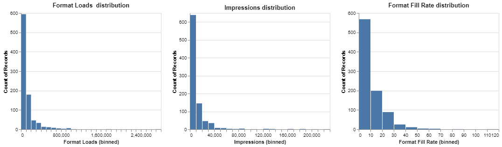
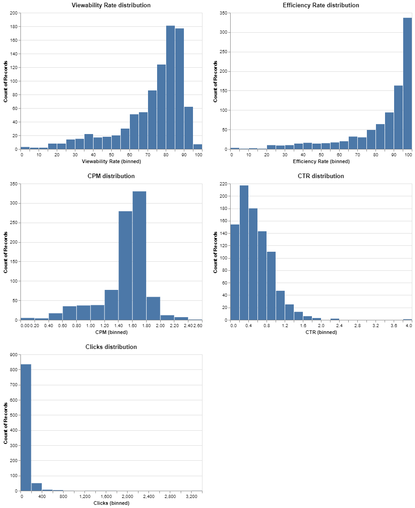
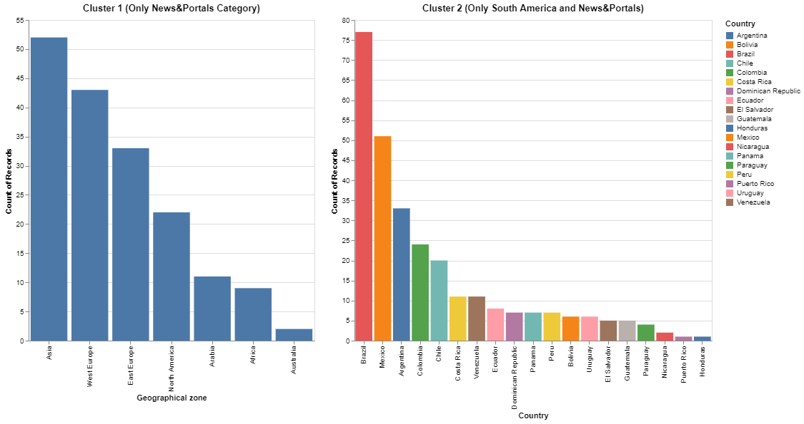
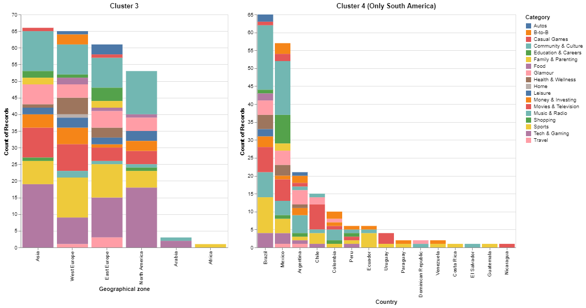

# FINAL PROJECT OF KSCHOOL MASTER
This repo contains the whole project of the Kschool Data Science Master

## **Context:**

This project is based on the data of a platform who monetizes the websites of the publishers, and provide the advertisers the space to deploy their ads and campaigns. These platforms take care of facilitate the access to the traffic of the websites that they work with, according to the advertiser interests and preferences.

There are hundreds of platforms especialized in this function. The advertisers ask these platforms to deploy and ad campaign, with a given budget and given goals to achieve. The company do the job and present the general results. The problem is usually that the advertiser doesn´t know the specific performance of these campaigns, for example why they obtained better results with those publishers in which the platform invest their budget. Furthermore, advertisers usually works not only with one platform, but they divide the budget into several, so it´s pretty difficult to have a global overview about what is really working, in order to replicate it in future campaigns. 

## **Project Overview:**

- Analyze the multiple variables that have to be taken into account in order to analyze the quality of the websites traffic. 
- Interpretate the general trends of the websites over the last 366 days. 
- Clustering the available websites to find if there is a way where we can packaged them in X groups with similar characteristics.
- Allow the platform to classify better the publishers and facilitate the proccess of running campaigns with the appropiate ones.
- Create an interactive tool which allows the advertiser to find the publishers , making also recommendations with the resulting clusters.
- **It´s important to point out** that  it´s a project especifically designed for the given company, only with his data. I´ll work with the websites that remain after applying a basic threshold (around 900). The regions or the categories of the domains, as we´ll see later, is clearly unbalanced, so the analysis will be influenced by this. Beacuse of that the results of this project can´t be generalized and are not representative of the whole market, it´s only a chunk of it.

## **Code and Resources Used:**

Python Version: 3.7.6 .

**Packages:** pandas, numpy, sklearn, matplotlib, seaborn, altair, scipy, yellowbrick, pyclustender, wget, streamlit

## **Data Extraction:**

The data has been obtained from the online private platform. Due to the row limitation it was download in 5 parts. 

To replicate the project:
- 1. Create a folder called "DATA" to save all the dataframes along the project
- 2. Create a folder called "Grapghs"
- 3. Reproduce first the Environment and Data extraction notebook [link] .It´ll install the necessary libraries and download the data from Google Drive. 

## **Data Cleaning and Engineering**

The downloaded data has 919.425 rows and 22 columns. It´s a daily report (366 days availables), where each row represents one day and the characteristics of one website.
After downloading the data and concatenate the five chunks of data,  I made the following changes and created the following variables [link]:

- **Drop** missing values.
- **Drop**  the columns that don´t add value to the advertiser or to the project´s goal.
- **Convert** object columns with symbols like ',' or '%' into integer or float columns.
- **Create** the main dataframe of the project through the daily data. The resulting dataframe have only one row for each domain, and the features are represented as the daily mean of the last 366 days.
- **Apply a treshold** (daily mean traffic higher than 20.000 Format Loads) to consider a domain representative and the way to drop the residuals. After this basic filtering, we keep the 901 observations/domains/websites that we are going to work with the rest of the project.
- **Add** a column with the Category of the domain through a given table.
- **Modify** the Category column to reduce the number of categories from 52 to 19, in order to make the analysis more understandable.
- **Add** the missing values in the Category column through a new table (manually made). 
- **Add** a column with the category importance. This represents the relative importance that each category has over the total traffic. 
- **Add** a column with the country where the main traffic (Format Loads) of each domain comes from, through a new table, downloaded from the online platform. In this table are all the countries that have traffic in each domain, so I have to keep the highest of each domain and merge with the main dataframe.
 -**Add** a column with the geographical zone or region of each website.
- **Add** a column to represent the geographical zone importance. This represents the relative importance that each region has over the total traffic.
- After the correlation matrix, **drop**  the variables about the View Rate percentages, which are the only ones that are very strongly correlated (more than 90%). I´ll keep the Viewability Rate column, where in some way the dropped variables are also represented.

## **Exploratory Data Analysis**

I looked at the distributions of the feautures and other interesting visualizations to understand the data better. Below are a few representative graphs:

- ### ***Continuous variables:***
  ,    ,  ,  

- ### ***Categorical variables:***
  ,  ,  

## **Model Building: Clustering**

- ## ***First part***

There was some problems with the data that I have had to deal with:

- Most of the variables didnd´t follow a normal distribution
- There are variables with a great number of outliers 
- There are categorical and continuous variables.

After looking for the correct combination of variables to make a good clustering model and taking into account the big differences of scale between some important variables (Format Loads and Impressions overall) although transformation to the data being applied,  I decided to keep for this first part only the variables represented by percentages: Format Fill Rate, 	CPM(is not a percentage but it has a similar scale to CTR) ,	CTR,	Category importance, and	Geographical zone importance

**Categorical variables issue:** 
- Categories and Geographical zone variables are, from a business point of view, two of the most important variables, because between the requirementes that the advertiser ask for with a new campaign, are the categories and te region where it has to be deployed. 
- I tried some clustering models that accept mixed data, i.e KPrototypes, but the results were confused and the cluster ere not well defined. 
- That´s why I finally create the Category importanace and Geographical zone importance columns, so the categories and regions could be representated in the model as the relative importance that each region/category has over the total traffic.

Before training the models, I made three different data transformations in order to compare the results in each model:

- Standarizing the data with Standard Scaler.
- Normalizing samples individually to unit norm with Normalizer.
- Transforming features by scaling each feature to a given range (0,1) with MinMax Scaler.

The trained models were:

- **KMEANS** (with GridSearchCV to choose the best hyperparameters) : most common algorithm and  usually the first option to try.
- **HIERARCHICAL CLUSTERING:** also very common and usually the second option, It also helps to visualize in a simple way the optimal number of clusters.
- **DBSCAN:** It has a good performance with dense data, and as we saw before that is the case. 
- **PCA + KMEANS:** By reducing the number of features, the performance of the algorithm can be improved. By decreasing the number of features the noise is also reduced. In the case of PCA and K-means in particular, there appears to be an even closer relationship between the two.

**The optimal number of clusters selection** in Kmeans was done with a visualization function which returns:
- A plot with the **Calinski-Harabasz score** for each k-clusters. This score computes the ratio of dispersion between and within clusters.
- A plot with the **Silhouette score** for each k-clusters : This score ompute the mean Silhouette Coefficient of all samples. The best value is 1 and the worst value is -1. Values near 0 indicate overlapping clusters, and negative values generally indicate that a sample has been assigned to the wrong cluster.
- A plot with the **Distortion score** for each k-clusters: computes the sum of squared distances from each point to its assigned center.

**To evaluate the results and the quality of each clustering**, I used also the Calinski-Harabasz and Silhouette scores, and I added the Davies Bouldin Score: The score is defined as the average similarity measure of each cluster with its most similar cluster. The minimum score is zero, with lower values indicating better clustering.

These were the results:

 

- **I´ll work with the clustering with the best Silhouette score and Calinski Harabasz Score, wich defineitely is THE KMEANS+PCA with MinMax Scaler.**

- **In this first clustering that the decisive variables have been the Category and the Geographical zone.**

 
  

**As we have have pretty well formed clusters where none of them represents more than 30% of the data, I´ll try in the nex Notebook to do another clustering for each cluster, in order to find other differences intra cluster, trying to gather the domains more precisely.**

- ## ***Final clustering***

[link] In this part, I apply a new clustering over the general clusters to define subclusters and make a deeper grouping of the websites.

 For this new clustering I am going to use 3 variables: **FORMAT LOADS, IMPRESSIONS AND CLICKS.** These are the 3 more important variables that I didn´t use in the first clustering, because the scale is extremely high (Format Loads and Impressions overall).
 
 In this case, I directly transform the data with the MinMax Scaler, which also gives in this case better results than other transformations.
 
 The clustering method used in this final clustering was also KMEANs + PCA, which gives tehe best results again, at least from a business point of view.
 
 ### ***Some observations about the subclustering proccess***

- In the four clusters there is a big subcluster which contains the  domains the worst quality of the cluster (low Format Loads, Impressions and Clicks).

- We can observe that the most decisive variable is Format Loads. The algorithm divide the clusters by Format Loads ranges, and Impressions and Clicks come into play when the Format Loads ranges are similar. Theorically, this could be a disadvantage because Format Loads have too much weight. But in this case, looking from a business point of view, it´s just what I need because that is the most important variable by far.
 
 - ### **Interactive visualization of the final subclusters through Tableau is available in this [link](https://github.com/rfisla/FINAL-PROJECT-OF-KSCHOOL-MASTER/blob/master/Graphs/SUBCLUSTERS%20VISUALIZATION.twbx)**

## **Final app**

[link](https://github.com/rfisla/Websites_traffic_analytics.git)

https://domains-recommentation.herokuapp.com/

## **Conclussions**
